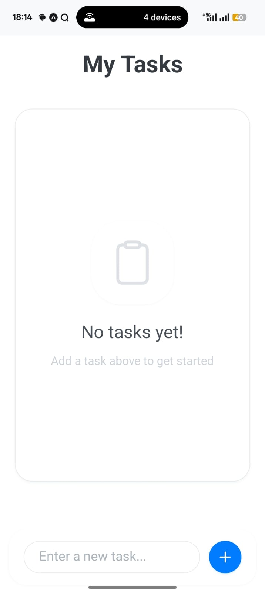
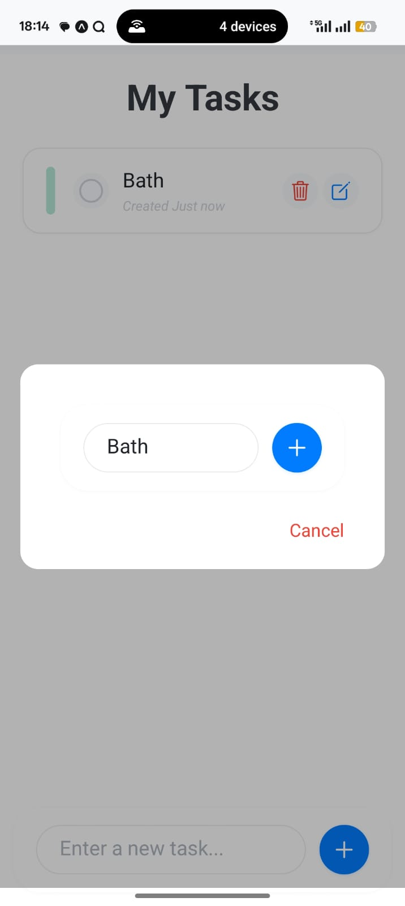
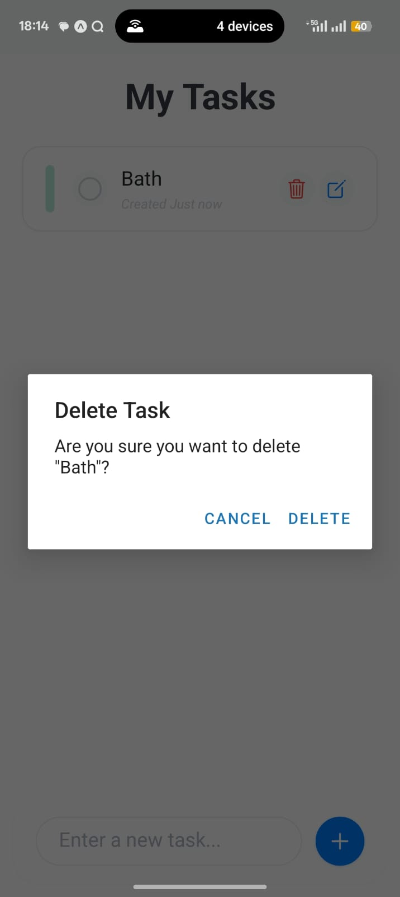
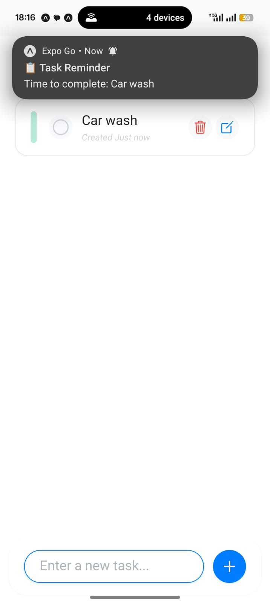
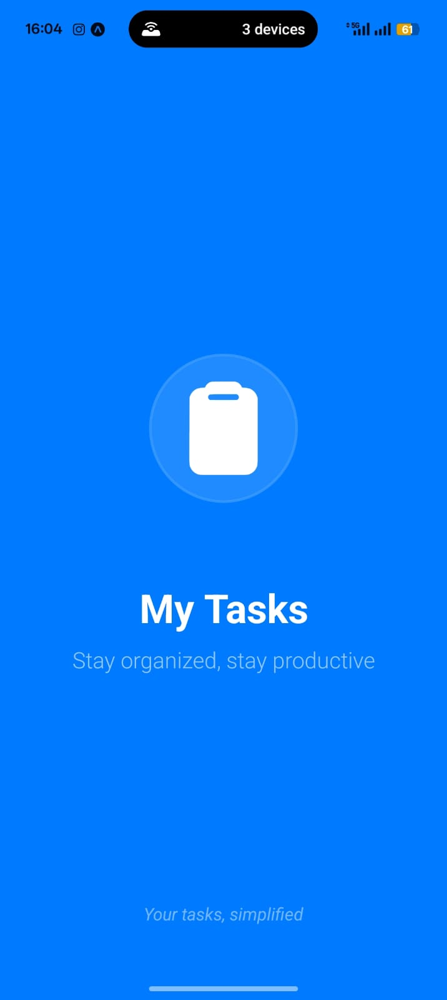

# Task Management Application
### Developed by Swaraj Dhage

<p align="center">
  
  
</p>

## 📱 Project Overview
A dynamic task management application developed as a internship assignment using React Native and Expo. This cross-platform solution demonstrates proficiency in mobile app development with focus on user experience and functionality.

## 🎯 Key Features
- Create, Read, Update and Delete tasks
- Task status tracking
- Intuitive user interface
- Local data persistence

## 🔧 Technology Stack
- React Native
- Expo Framework
- AsyncStorage
- React Navigation
- Native Base UI

## 📸 Screenshots

### Home Screen

> Task overview and management dashboard showcasing the main interface where users can view and manage their tasks.

### Task Management
<p float="left">
  
  &nbsp;&nbsp;&nbsp;&nbsp;
  
</p>
> Left: Task editing interface for modifying existing tasks
> Right: Task deletion confirmation dialog for safe task removal

### Notifications

> Task reminder notifications to keep users updated about their tasks

### Loading Screen

> Application splash screen showing the initial loading state

## ⚙️ Installation

1. **Clone the repository**
```bash
git clone [repository-url]
```

2. **Install dependencies**
```bash
npm install
# or
yarn install
```

3. **Install Expo CLI globally** (if not already installed)
```bash
npm install -g expo-cli
# or
yarn global add expo-cli
```

4. **Start the Expo development server**
```bash
npx expo start
```

## 📱 Running the App

- iOS: Press 'i' in terminal or run on iOS simulator
- Android: Press 'a' in terminal or run on Android emulator
- Web: Press 'w' in terminal or open in web browser

## 🎨 Features Implementation

### Data Persistence
- Local storage using AsyncStorage
- Efficient data management
- Offline functionality

### User Interface
- Clean and intuitive design
- Responsive layouts
- Cross-platform consistency
- Interactive elements

### Component Architecture
- Modular component design for maximum reusability
- Separate components for:
  - TaskItem: Task display component with completion toggle, edit and delete functionality
  - TaskInput: Reusable input component for creating and editing tasks
  - EmptyState: Customizable empty state display component
  - LoadingScreen: Animated loading screen with progress indicators
- Component Features:
  - Props-based configuration for flexibility
  - Consistent styling
  - Integration with AsyncStorage for data persistence
  - Built-in error handling and validation
  - Responsive design across different screen sizes


## 🧪 Testing
- Component testing
- Functionality verification
- Cross-platform compatibility


## 🚧 Development Challenges & Expo Go Issues

During the development of this application, I encountered several challenges, particularly related to the Expo Go environment:

- **Push/Local Notification Issues:** Expo Go has limitations with handling background tasks and notifications, especially on iOS. Sometimes notifications would not trigger as expected, or would be delayed, due to restrictions in the Expo Go client and OS background execution policies.
- **Native Module Limitations:** Some advanced features (like custom notification sounds or scheduling precise background jobs) are not fully supported in Expo Go, requiring either ejecting to Expo Bare workflow or using workarounds.
- **Testing on Real Devices:** Certain features (like notifications) behave differently on simulators/emulators versus real devices. Debugging these inconsistencies required frequent device testing and reading Expo documentation.
- **Hot Reload/Refresh Bugs:** Occasionally, hot reloading in Expo Go would cause state or notification listeners to behave unexpectedly, requiring a full reload or app restart.

Despite these challenges, I was able to implement reliable local notifications and a smooth user experience by carefully reading Expo documentation, testing on multiple devices, and using best practices for React Native development.

## 👨‍💻 Developer Information
- Developer: Swaraj Dhage


---
*This project was developed as part of an internship application assignment to demonstrate mobile application development capabilities using React Native and Expo.*
